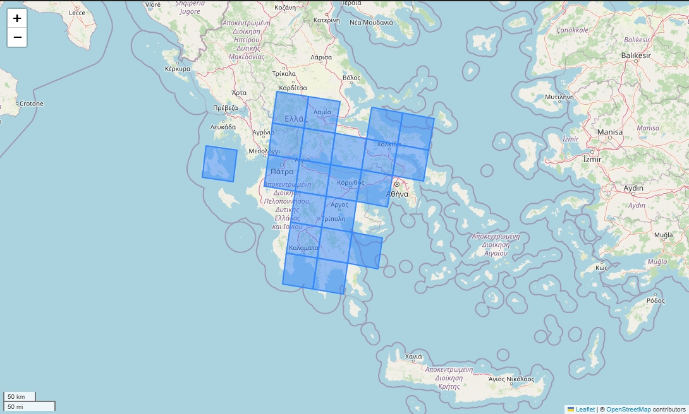

# Drought monitoring in Greece

## Description
This research project analyzes drought impacts on Greek mountain ecosystems, focusing on fir forest (Abies cephalonica) die-off in regions such as Chelmos, Mainalo, Taygetos, Parnonas, and Epirus. The work includes environmental monitoring, GIS mapping, climate data analysis, and the development of strategies for resilience and restoration. [source: [dasarxeio.com](https://dasarxeio.com/2025/08/01/145507/?fbclid=IwQ0xDSwL56MVleHRuA2FlbQIxMQABHkbJokQhCMbPWyp9B5BhfTiQjc_i3rtFTZOzDlfeDrLWeoQALBKSSqs7HktX_aem_boICuxbIGToYjKLmx3ZoFQ)]

## EODC Development
Based on [Open Data Cube](https://www.opendatacube.org/). For the EODC, the following steps have been completed:
1. Created a [database](https://opendatacube.readthedocs.io/en/latest/installation/database/setup.html) and [credentials](https://opendatacube.readthedocs.io/en/latest/installation/database/passing-configuration.html)
2. Created a Python `environment.yaml`
3. [Initialized](https://opendatacube.readthedocs.io/en/latest/installation/cli.html#datacube-system-init) the datacube schema
4. Generated a tiling grid schema covering Natura sites
5. [Defined EO products](https://opendatacube.readthedocs.io/en/latest/installation/product-definitions.html)
6. Verified dataset storage, indexing, and retrieval from NAS using EO3 datasets and EODC

### Tiling schema
The study area is divided into 21 tiles, each measuring 48 × 48 km. Tile naming follows the format `x00y00` format without negative indices. In 20-m imagery this translates to time×variables×2400×2400 pixel time series. A 2400×2400 size was found appropriate for an effective processing in a 32GB - 8 CPU configuration, with an average product delivery time of 7 minutes.



## Composite generation
The composite pipeline automates the creation of monthly median mosaics of Sentinel-2 L2A data using the [Planetary Computer](https://planetarycomputer.microsoft.com/dataset/sentinel-2-l2a) via the [STAC catalog](https://planetarycomputer.microsoft.com/api/stac/v1).

### Key points
- **Input**: GeoJSON configuration files define the year–month and tile code to process.
- **Data access**: Images are retrieved from the STAC catalog using [odc-stac](https://odc-stac.readthedocs.io/en/latest/), filtered by cloud cover (`≤70%`) and data quality (`nodata < 33%`).
- **Native resolutions**: Sentinel-2 provides bands both at 10 m and 20 m resolutions. Since 10 m bands are not natively [available at 20 m](https://planetarycomputer.microsoft.com/dataset/sentinel-2-l2a), we apply the `rasterio.enums.Resampling.average` method to bin the resolution to 20m. 
  - Implementation note: *If it is applied on a subset the values may vary (due to starting pixel and shape of the raster), but if it applied on a whole granule the values are identical*. [Sen2Cor](https://step.esa.int/main/snap-supported-plugins/sen2cor/sen2cor-v2-12/) uses [`skimage.measure.block_reduce`](https://github.com/scikit-image/scikit-image/blob/v0.25.2/skimage/measure/block.py#L5-L94) (and from [docs](https://scikit-image.org/docs/0.25.x/api/skimage.measure.html#skimage.measure.block_reduce)), as it can be found in [S2 MPC L2A ATBD](https://step.esa.int/thirdparties/sen2cor/2.10.0/docs/S2-PDGS-MPC-L2A-ATBD-V2.10.0.pdf), to perform 2×2 mean aggregation (binning), as it can be found in the `L2A_Tables.py` module. This is also available in `xarray`'s [`coarsen`](https://docs.xarray.dev/en/stable/generated/xarray.DataArray.coarsen.html#xarray-dataarray-coarsen) function, which is a replica of this function as stated [in this issue](https://github.com/pydata/xarray/issues/2525). This ensures consistency with ESA’s Sen2Cor processing chain.
- **Baseline change**: Working with S2-L2A time series from MS PC requires a [baseline change](https://planetarycomputer.microsoft.com/dataset/sentinel-2-l2a#Baseline-Change) [to Sen2Cor `4.00` ](https://sentinels.copernicus.eu/web/sentinel/-/copernicus-sentinel-2-major-products-upgrade-upcoming). For scenes after `2022-01-05` (January 25th, 2022), an offset of `-1000` is applied.
- **Masking**: Cloud, shadow, cirrus, and snow/ice pixels are masked using the Scene Classification Layer (SCL).
- **Spectral indices**: [NDVI](https://www.indexdatabase.de/db/i-single.php?id=58), [EVI](https://www.indexdatabase.de/db/i-single.php?id=16), and [PSRI2](https://www.indexdatabase.de/db/i-single.php?id=69) are calculated per timestamp before median temporal reduction.
- **Reprojection**: Before reduction, the data cubes are aligned and reprojected in [ETRS89-extended / LAEA Europe (EPSG:3035)](https://epsg.io/3035) with [odc-geo](https://github.com/opendatacube/odc-geo), using `rasterio`'s [bilinear resampling](https://rasterio.readthedocs.io/en/stable/topics/resampling.html). If more than two UTM zones are included, a mosaic is generated.
- **Compositing**: A median temporal composite is produced per tile and month.
- **Output**: Results are stored as Cloud-Optimized GeoTIFFs (COGs), with metadata ([dataset definitions](https://opendatacube.readthedocs.io/en/latest/installation/dataset-documents.html)) recorded in both [EO3 YAML](https://eodatasets.readthedocs.io/en/eodatasets3-1.9.3/) and [STAC JSON](https://pystac.readthedocs.io/en/latest/index.html) formats for datacube indexing. The `assets`/`measurements` are stored in paths relevant to the metadata document location. *To do so on a local machine, raster information were referenced [by explicitly providing geo and pixel](https://eodatasets.readthedocs.io/en/eodatasets3-1.9.3/_modules/eodatasets3/assemble.html#DatasetPrepare.note_measurement) information to the metadata preparation module.* To load the relevant paths of raster images from NAS into `xarray`, [url patching](https://opendatacube.readthedocs.io/en/stable/api/indexed-data/generate/datacube.Datacube.load.html#datacube.Datacube.load) is required.

## Normalized time series

## Classification

## OWS

To serve data indeced in the EODC as visualizations, datacube-ows provides the WMS web service endpoint to (in our case) a TerriaJS web map client, by [configuring](https://datacube-ows.readthedocs.io/en/latest/cfg_wms.html) the OWS
- Styles: Styles and Layers are configured in the [`ows` configuration module](https://github.com/fotakide/drought/blob/main/ows/drought_config/ows_cfg_drought.py)
- Update: Periodically withing the EO pipelines, or at the end of each one, the OWS database [is triggered](https://github.com/fotakide/drought/blob/main/src/run_composites.py#L81) [to be updated](https://datacube-ows.readthedocs.io/en/latest/database.html) automatically.
- Output: The [WMS](http://localhost:9000/?service=WMS&request=GetCapabilities) of the data indexed is provided to a [TerriaJS](https://terria.io/) client, and are available via a NGROK app (https://emt-datacube-viewer.ngrok.app/).

Implementation note:
 - *Dont' forget to allow fire sharing in Docker*
 - [Initialization](https://datacube-ows.readthedocs.io/en/latest/database.html#creating-or-updating-the-ows-schema):
  1. `docker exec -it drought-ows-drought_ows-1 bash`
  2. `datacube system check`
    - `Valid connection:       YES`
  3. `datacube-ows-update --schema --write-role odc_phd --read-role odc_phd`
  4. `datacube-ows-update --views`
  5. `datacube-ows-update`

*If below error, then metadata are not in relative paths:*
```
Ignoring Exception: /nas-domain/2020/06/x06_y10/\\nas-domain\2020\06\x06_y10\S2L2A_medcomp_x06_y10_202006_B02.tif: No such file or directory
```

### Vizualization
The images are loaded from NAS by [patching the URL](https://datacube-ows.readthedocs.io/en/latest/cfg_layers.html#url-patching-patch-url-function) to the mounted volume inside the Docker container.

## References

Hislop, S., Stone, C., Gibson, R.K., Roff, A., Choat, B., Nolan, R.H., Nguyen, T.H. and Carnegie, A.J., 2023. [Using dense Sentinel-2 time series to explore combined fire and drought impacts in eucalypt forests](https://www.frontiersin.org/journals/forests-and-global-change/articles/10.3389/ffgc.2023.1018936). *Frontiers in Forests and Global Change*, 6, p.1018936.